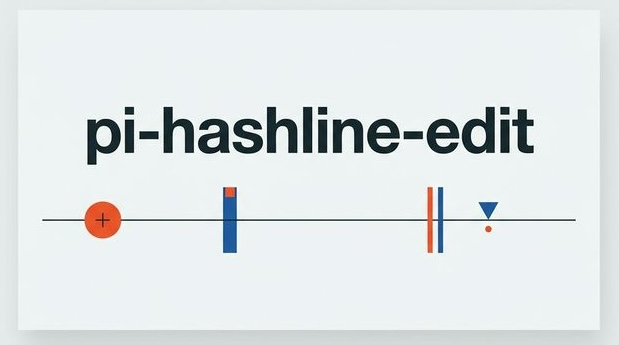

# pi-hashline-edit-merged

A focused merged hashline editor for pi with split tools and safety guardrails. A [pi-coding-agent](https://github.com/badlogic/pi-mono/tree/main/packages/coding-agent) extension.

Default extensions: `extensions/core.ts` and `extensions/insert.ts`.
Optional extensions: `extensions/grep.ts` and `extensions/undo.ts`.
`tool-usage` is intentionally not part of this merged package.

Every line returned by `read` carries a short content hash. Edits reference these hashes instead of raw text, so the tool can detect stale context and reject outdated changes before they reach the file.

Inspired by [oh-my-pi](https://github.com/can1357/oh-my-pi).

## Differences from upstream

This is a fork of the original [pi-hashline-edit](https://github.com/RimuruW/pi-hashline-edit). The core protocol (hash-anchored reads, stale-anchor rejection, atomic writes) is unchanged from upstream. Key differences:

- **Split tool design.** Insertion and replacement are separate tools (`insert` and `edit`) rather than optional `op` fields on a single tool. Each operation has a clear set of required fields — the model picks a tool and fills in everything, never asks "do I need field X for operation Y?".
- **Standard hex hash alphabet.** `0-9 A-F` instead of `ZPMQVRWSNKTXJBYH`. Hex pairs are more likely to be single tokens.
- **Symmetric boundary-duplication detection.** Runtime warnings catch duplicated boundary lines on both sides of a replacement, not just trailing.
- **`read` raw mode.** `raw: true` returns plain text without `LINE#HASH│` anchors, for reads that don't plan to edit.
- **Context-based FNV-1a hashing.** Each line's hash incorporates its immediate neighbors (previous and next). Distant edits don't invalidate anchors; nearby edits do, which is the intended safety behavior.
- **Minimal prompt surface.** Prompt text describes what the model needs to use the tool; return-format documentation and error catalogues are omitted.
- **No legacy compatibility.** The `{ oldText, newText }` substring-replace format is not accepted. The schema is hashline-only.

## Installation

```bash
# From npm
pi install npm:@jerryan/pi-hashline-edit

# From a local checkout
pi install /path/to/pi-hashline-edit
```

### Toggling individual tools

Each tool is its own extension file. The package ships all of them; enable or disable individual tools via pi's built-in resource filtering:

```json
{
  "packages": [{
    "source": "npm:@jerryan/pi-hashline-edit",
    "extensions": [
      "extensions/core.ts",
      "extensions/undo.ts"
    ]
  }]
}
```

Available extensions: `extensions/core.ts`, `extensions/insert.ts`, `extensions/undo.ts`, `extensions/grep.ts`.

Or use `pi config` to toggle them interactively.

**Rule:** either keep `core.ts` enabled, plus any add-ons, or disable everything.

## How It Works

### `read` — tagged line output

Text files are returned with a `LINE#HASH│` prefix on every line. Line numbers may be left-padded within each returned block so the `#HASH│` columns align:

```text
 8#A4│function hello() {
 9#3F│  console.log("world");
10#B2│}
```

- `LINE` — 1-indexed line number.
- `HASH` — 2-character content hash (hex digits `0-9 A-F`).

Optional parameters:
- `offset` — start reading from this line number (1-indexed).
- `limit` — maximum number of lines to return.
- `raw` — when `true`, returns plain text without LINE#HASH anchors. Saves tokens when you don't plan to edit this file.

Images (JPEG, PNG, GIF, WebP) are passed through as attachments and do not participate in the hashline protocol. Binary and directory paths are rejected with a descriptive error.

### `edit` — hash-anchored modifications

Each edit entry replaces an inclusive anchor range:

```json
{
  "path": "src/main.ts",
  "edits": [
    { "range": ["11#3F", "11#3F"], "lines": ["  console.log('hashline');"] },
    { "range": ["42#B2", "45#C7"], "lines": ["function foo() {", "  return 42;", "}"] }
  ]
}
```

- `range` — `[start, end]` pair of LINE#HASH anchors. Use the same anchor twice for single-line.
- `lines` — new content replacing the range (string array). Use `[]` to delete.

All edits in a single call validate against the same pre-edit snapshot and apply bottom-up, so line numbers stay consistent across operations.

### `insert` — anchor-based insertion

Each entry inserts new lines relative to a single anchor line:

```json
{
  "path": "src/main.ts",
  "edits": [
    { "anchor": "5#A3", "direction": "after", "lines": ["import { foo } from './lib';"] },
    { "anchor": "1#B2", "direction": "before", "lines": ["#!/usr/bin/env node"] }
  ]
}
```

- `anchor` — a LINE#HASH anchor from a recent `read`. The anchor line is preserved — `lines` go after or before it.
- `direction` — `"after"` or `"before"`.
- `lines` — the new content to insert (string array). Do not include the anchor line's content.

Unlike `edit` (which replaces a range), `insert` only adds content. All existing lines stay exactly as they are. The same stale-anchor safety and atomic-write guarantees apply.

### `grep` — hashline-backed search

Returns matching lines with `LINE#HASH│` anchors (same format as `read`), so results can be used directly with `edit` or `insert` without an intermediate read. Respects `.gitignore` by default.

Parameters:
- `pattern` (required) — regex or literal search pattern
- `path` — directory or file to search (default: project root)
- `glob` — file filter, e.g. `*.ts` or `**/*.spec.ts`
- `ignoreCase` — case-insensitive mode
- `literal` — treat pattern as a literal string
- `context` — lines of context before/after each match
- `limit` — maximum matches (default 100)

Matches are grouped by file and formatted with `LINE#HASH│` anchors. Context lines also receive hashes, so surrounding lines can be used as edit anchors too. Output is truncated to 100 matches or 50KB.
### Chained edits

After a successful edit, the response contains a unified diff where context and added lines carry fresh `LINE#HASH` anchors. These can be used directly in the next `edit` call on the same file without a full re-read, provided the next edit targets the same or nearby lines. For distant changes, use `read` first.

### Diff output

Each edit result shows a unified diff with hashline-formatted lines:

```text
 8#A4│function hello() {
-9   │  console.log("world");
+9#B1│  console.log("hashline");
10#B2│}
```

- Context lines: ` NN#HH│content` (space prefix)
- Removed lines: `-NN   │content` (no hash, aligned separator)
- Added lines: `+NN#HH│content` (hash for new anchors)
- Multiple hunks are shown when edits are far apart.

## Design Decisions

- **Multi-tier stale‑anchor resolution.** When anchors don't match the live file, the tool tries three strategies in order: (1) exact match — some edits may still be valid against current content; (2) fuzzy relocation — if the target content shifted by ±1 line (single-line edits) or ±2 lines (multi-line), the range is silently corrected with a `[RELOCATED]` warning; (3) snapshot merge — if the anchors match the most recent `read` snapshot but not the live file, a 3‑way merge rebases the edits. Any edit that survives all three tiers is applied; any that fails rejects the entire request with `[E_STALE_ANCHOR]`.
- **Strict patch content.** If `lines` contains `LINE#HASH│` display prefixes or diff `+`/`-` markers, the edit is rejected with `[E_INVALID_PATCH]`. The model must send literal file content; the runtime does not silently strip accidental prefixes.
- **Full-file deletion guardrail.** Edits that would empty a file with more than 50 lines are rejected with `[E_WOULD_EMPTY]`. Small files show the full diff normally; large deletions are almost always mistakes.
- **Atomic writes.** Files are written via temp-file-then-rename to avoid corruption from interrupted writes. Symlink chains are resolved so the target file is updated without replacing the symlink. Hard-linked files are updated in place to preserve the shared inode. File permissions are preserved across atomic renames.
- **Per-file mutation queue.** Edits queue by the canonical write target, so concurrent edits through different symlink paths still serialize onto the same underlying file.
- **Schema-delegated validation.** Field-type and schema validation are the responsibility of pi's AJV layer. The extension's runtime guard only prevents crashes from missing required top-level fields.
- **Split tools over optional fields.** Upstream and the original oh-my-pi protocol pack `append`/`prepend`/`replace` into a single tool via an `op` field with optional `after`/`before`/`range` parameters. We split them into separate tools (`edit` for replacement, `insert` for insertion). Agents struggle with optional fields — they use them randomly or forget them. With separate tools, each operation has only required fields. The model decides "do I want to insert or replace?" then fills in everything. No branching on optional parameters.

## Hashing

Hashes are computed with inline FNV-1a (32-bit, mask-reduced to 8 bits), then mapped to a 2-character hex string from `0-9 A-F`.

Each line's hash incorporates the line itself plus its immediate neighbors (previous and next). Missing neighbors at file boundaries contribute an empty string. This means:
- **Distant edits are stable.** Changing line 100 does not invalidate anchors on line 1.
- **Nearby edits are detected.** Changing line 5 invalidates anchors on lines 4, 5, and 6, because their context changed. The model must re-read to get fresh anchors for edits in that vicinity.

## Development

Requires [Node.js](https://nodejs.org) and npm.

```bash
npm install
npm test
```

Set `PI_HASHLINE_DEBUG=1` to show an "active" notification at session start.

## Credits

Based on [pi-hashline-edit](https://github.com/RimuruW/pi-hashline-edit) by [RimuruW](https://github.com/RimuruW), which in turn is built on the hashline concept from [oh-my-pi](https://github.com/can1357/oh-my-pi) by [can1357](https://github.com/can1357).

## License

[MIT](LICENSE)
